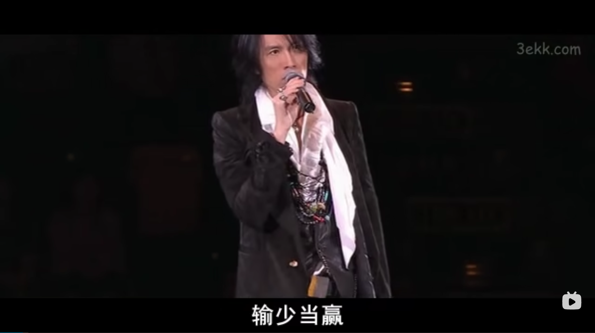

# 输少当赢

> 2022-08-26

一直以来都很纠结怎么有效利用生活中公交地铁上晃荡的通行时间来提升或放松自己，在今年年初那几个月开始尝试听了一阵子播客，
后来偶尔入坑了一档谈话节目叫「谐星聊天会」（以下简称谐聊），发现居然意外地合我胃口，半年多下来断断续续居然也听完了两季。
然而随着听播客的频率变高，谐聊的更新频率已经不能满足我的胃口，加之其[马上进入「休渔期」](https://weibo.com/7329644810/M2xsYeaw6)，
因此我尝试去寻找其他的喜剧节目，于是便了解到一个这几年在国内很火的一类节目：stand-up comedy，标准翻译为「单口喜剧」，目前在大陆也经常称之为脱口秀。
脱口秀本身其实为 Talk Show 的翻译，原本在国外为谈话节目，在国内比较接近的应该是类似「鲁豫有约」和「锵锵三人行」这类嘉宾与主持之间对谈的形式，但近几年在国内含义已经扩大化了。严格来说现在国内的新兴节目如「脱口秀大会」和「吐槽大会」都应属于单口喜剧，不过也不必在此多作纠结。

现在国内比较知名的单口喜剧/脱口秀制作团队有两个：单立人和笑果文化。上述提到的谐聊即属于单立人出品，而脱口秀大会和吐槽大会都由笑果文化出品和策划。从风格上来说单立人给我感觉是更 old school，偏学院派，其确实也推出了一些单口喜剧表演入门资料如[「单口喜剧表演手册 V1.1」](https://yes1am.github.io/stand-up-comedy/)以及一些其他的单口喜剧培训课程。而笑果则给我感觉更偏年轻化和流行化，不过我并未怎么完整的看过笑果旗下的节目。只在 B 站上或生活中偶尔被推送到脱口秀大会/吐槽大会的新闻，之前杨笠的那阵男女对立风波也是被动了解，另外还陪堂妹一起看过一小时左右的脱口秀大会的表演，能想起来名字的有杨笠、豆豆还有徐志胜。从内容上来说他们的表演并未吸引到我，不管是借助男女对立的话题收获流量，还是通过对自己外貌的自嘲来取悦观众，感觉都称不上高级。如果把前者比作为挥刀向更弱者，那后者就近乎于自残（当然我并不反对自嘲，但是自嘲背后应该是对自己的自信与洒脱，而不是去取悦他人）。不过这可能也怪不得他们，如今互联网上各个内容平台的舆论氛围都越来越敏感紧张，发表言论和观点已经成为了一个颇具有危险性的事，这种情况下这些脱口秀演员都像戴着镣铐起舞，这时候还要求他们能够针砭时弊，面向强者挥刀未免也太强人所难了。

无聊之下我先是转向了国外的单口喜剧表演，这个在 B 站还有大量的转载（例如[这个](https://www.bilibili.com/video/BV1Qi4y1s72w/?spm_id_from=333.788.recommend_more_video.1&vd_source=d851e3bec8c9953e068c43f4dcc09111)似乎非常经典）。但是单口喜剧通常会结合大量的事时以及当地文化，在对背景不熟悉的时候情况下会错失很多个梗，我在看完一大段之后很多次不能理解观众的爆笑。在郁闷之中突然想起来一位老友 F 推荐过的香港的单口喜剧「栋笃笑」，在 B 站一搜发现资源还不少，遂尝试点开榜首的[「哗众取宠」](https://www.bilibili.com/video/BV1kW4111711?spm_id_from=333.337.search-card.all.click)看了个开头，没想就一发不可收拾。当时还是在实验室，中间憋笑差点憋出内伤。在当天晚上看完整个「哗众取宠」的演出后，我已经深深爱上了这档节目和这个被称之为「子华神」的男人（当即上 PT 站下完了全部的栋笃笑资源）。在此之前，我很难想象我会被一档十余年前的演出，被一个当时已经 50 岁的人深深折服。后来深扒了一下了解到，黄子华本身即为国内单口喜剧的始祖人物，「栋笃笑」这一词亦是他自己独创的翻译。虽然我对粤语只是处于勉强能听懂的水平，但是亦能感觉出这个翻译的传神。黄子华本人前面数十年也算跌宕起伏，有兴趣可以自行查阅。
说回这场栋笃笑，「哗众取宠」的演出是在 2010 年，当时金融海啸的风波尚未平息，同时艳照门事件又在香港娱乐圈掀起渲染大波（此后多少人再也无法直视儿时的男神女神）。具体表演内容在此不作剧透，不过其中出现的一句被黄子华称为自己人生信条的四字俚语很值得分享，即本文标题：输少当赢（写到此处去重温了一下子华神在此的表演，又一次被笑到内伤哈哈哈哈哈）。

自 2018 年贸易战以来，感觉国内的经济形势就仿佛被按下了慢行键，再连着 19 年末开始的三年疫情以及后面的一连串连锁反应，感觉经济形势更是进入了所谓的「全域静默」。加之最近频繁的中美摩擦，以及各种不可言说的魔幻现实，越发让人在不自觉中感到焦虑。根据口红效应来说，可能这也是为何这几年脱口秀类节目大火的原因，大家都需要一定的幽默和吐槽来调剂自己的心情。在这种焦虑下，我时常会想起自念大学以来那些做错的决定，那些错过的机会，并时常陷入一种患得患失的心理状态。我常常梦见自己被赶回高中，重新高考。在梦中之时我一方面为自己的年纪感到焦虑，另一方面甚至有点高兴能有再来一次的机会，以至于醒来的时候脑子时常还没有转过弯来，在接着思考再高考一次的可能。我一方面为自己过去的错误懊恼，一方面还为自己的懊恼陷入更深的懊恼，觉得自己过于敏感软弱，容易在这个暗流涌动的时代被冲击得晕头转向，无处立足。我也一直努力尝试着调整心态，鼓励自己积极乐观看待事物，时不时安慰自己：吾本农村布衣，research 与我何加焉。虽然道理都懂，始终是知易行难，依旧间歇性地陷入一种抑郁迷茫的状态。然而不知为何，子华神的这段戏谑中演绎的「输少当赢」的桥段突然疗愈了我（当晚睡觉果然不再梦回高考），让我一下看开许多，仿佛拿掉了生活中一层灰蒙蒙的滤镜（也可能是在生活中加上了一层提高亮度和对比度的滤镜）。对我来说，我是第一次感受到这类喜剧性表演带来的力量与触动，并体会到单口喜剧作为喜剧艺术的艺术性的一面。因而在此记录与分享，读者朋友若是有碰到了陷入情绪低谷的时候，不妨也以此作为调剂心情的一贴良药。当然栋笃笑的内容远不止于此（哪怕只是这一期），在陪着子华神的表演欢笑的过程中，可以明显感受到嬉笑怒骂之下的人文关怀的一面，因此对单口喜剧或脱口秀有兴趣的朋友，不妨找几集栋笃笑感受一下这个男人身上的才华与魔力，相信一定不会后悔。

