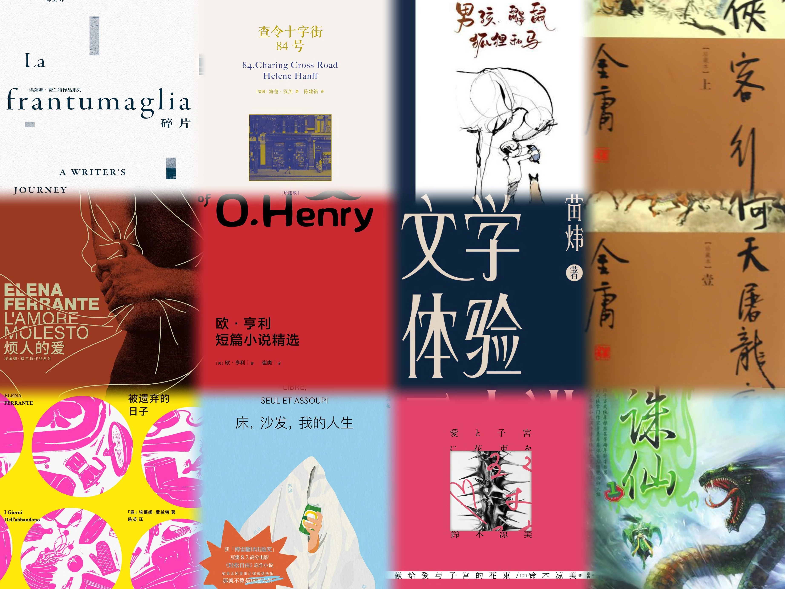
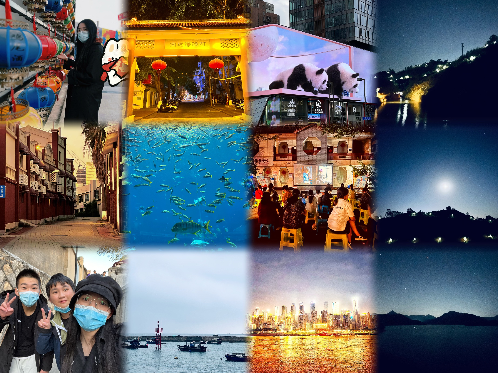

# 2023 年度总结

> 2023-12-31

这一年里发生了许多转变，最为突出的应该就是九月在 LGU 博士入学了。自 2020 年毕业后兜兜转转、时隔三年再度拥有了学生身份，踏上了读博之路，却总感觉自己和同学之间有些心态和角色上的不一致，可能正应了那句「欲买桂花同载酒，终不似，少年游」吧。

回望今年，大大小小好好坏坏的事情都发生了不少，许多事情当时觉得是天翻地覆般的改变，觉得一定要找个方式去记录和讲述，然而时隔几月，最终又化成了一句「不足为外人道也」。年初立了许多目标，其中很重要的一个主题就是记录生活，而之前每天一记的 flag 已经倒得不能再倒了，在这里就把年度总结的 flag 圆上吧。

## 阅读

今年在阅读上主打的就是一个「博而不渊」，说实在点就是挖坑不填。微信读书年度报告显示今年总共翻过了 74 本书，然而实打实读完的只有 13 本。算上手头上有的纸质书，实际读完的也就 15 本左右，其中还有好几本是被我视作洗手间读物的绘本。虽然我对自己每年的阅读通常没有一个定量的要求，但是考虑到如果按 80 岁的寿命期望来算，我的人生也就只剩五十来年了，如果每年再只读这么点书，那这一生所能看到的文字就太有限了。希望明年能在这个基础上翻个番，读到 30 本左右吧。这里我尝试模仿 pluskid 把书单和简单的书评列出来，更详细的阅读感悟就要看后面有没有毅力去[阅读笔记](https://markwwen.github.io/blog/#/reading/)里整理出来了。

1. 《碎片》🌟🌟🌟🌟🌟
这本书收录了埃莱娜生活的书信往来，按年代分为三辑，刚好对应埃莱娜的三本比较出名的作品：《烦人的爱》、《被遗弃的日子》、《那不勒斯四部曲》。我第一次见到这本书是在 2021 年，虽然之前也零零散散地在一些公交地铁的时间间隙里翻完过，但是当时一是过于零碎，二是缺乏对前面两部作品的了解，始终感觉如同走马观花。今年来一是买了 iPad，有了相对体验较好的阅读工具，二来从 Z 那里拿到了纸质版的图书，加上入学之后又有了相对规律的时间，终于是把书好好地看上了几遍。不同于《那不勒斯四部曲》中波荡起伏的故事，在《碎片》中埃莱娜更真实、更直接地讲述了她的许多思考。有时候读着读着我耳边会出现她的声音，仿佛她就坐在我面前一般。不知为何，她的文字总是很唤起我人性和回忆里一些很深切的共鸣和记忆，有些是我早已遗忘的，有些是我刻意掩埋的。每次她挖掘出我那些难以表达、不愿意暴露和原本认为无法被理解的情绪时，我总是有一种热泪盈眶的冲动，忍不住感叹：怎么能不爱你呢，埃莱娜。

2. 《烦人的爱》🌟🌟🌟🌟🌟
埃莱娜的处女作，读起来有点像侦探小说的感觉。到最后结局揭晓的时候我感觉颇为意外，甚至有种汗流浃背的感觉。很难在不剧透的情况下去点评这本书的内容，而从感受上来说我觉得埃莱娜总是能在小说中呈现一面镜子，镜子里面反射的是那些会被可以掩埋的人性，那些在伟光正作品中忽视或者压抑的人性。

3. 《被遗弃的日子》🌟🌟🌟🌟🌟
为了《碎片》去补的埃莱娜的第二部作品。相对于《烦人的爱》这部书的主线清晰很多，主要就是关于一个女人在被遗弃后的经历和感受。对我而言，埃莱娜的文字总是很细腻又富有感染力，在书里发生的那些伤害会非常具象地在我眼前呈现开来，其中一些我能感同身受，另一些则让我觉得新奇又沉重。在阅读中我有时候会代入其中那个男性的视角，脑子里一直回荡一句不知从何而来的话：你当然有选择的自由，但也必须知晓选择的成本和代价，乃至选择的责任。

4. 《查理十字街 84 号》🌟🌟🌟🌟🌟
从 Z 那里得来的书，虽然和《碎片》一样同为书信集，但是读起来相当地轻松和愉快，书中的友谊和乐趣经常让我忍不住发笑，有那么几晚我把它放在床边，在每天睡前翻上一章，不过很快因为床的空间太小被我移到实验室来了。

5. 《欧·亨利短片小说选》🌟🌟🌟🌟🌟
总的来说是一些诙谐而温馨的故事，而欧亨利的神转折又总是那么令人惊呼。有几个故事是很小的时候就读到的，比如《麦琪的礼物》、《最后一片叶子》和《一位幽默家的自白》等等。和埃莱娜的小说不同，欧亨利的文笔里总是有一些很古早的人性里的善意，像是童话故事一般，总是给我另一种人性上的触动。

6. 《男孩、鼹鼠、狐狸和马》🌟🌟🌟🌟🌟
另一本从 Z 那里得来的绘本。最早是从 Z 的微博上看到片段，感觉很受打动，后来在电子版读过一遍后一直觉得非常治愈，自己也给不少人安利过。总的来说是可以在 30 分钟内体验完的一场小小的精神 spa。

7. 《床、沙发、我的人生》🌟🌟🌟🌟
同学推荐的一本小品般的小说，作者可谓将摆烂进行到了极致，因此竟然也发展出了一套颇为自洽的人生观。在我看来，无论是像社会期望主流一样积极向上，还是像作者一样无欲无求，都能找到使自己幸福满足的方式，最终能真正地自我接纳就好，两派没有必要互相对对方进行攻击和意识形态输出。然而似乎更多的人被夹在中间，既拿不起，又放不下，一直找不到自我接纳的方式。而另一面，这本书也经常被我和最近刷即刻看到的一段话联想起来：**好消息是，在你生活的年代，你几乎可以娱乐和解构一切。坏消息是，在你生活的年代，几乎（你的）一切都是可以被娱乐和解构的。**

8. 《文学体验三十讲》🌟🌟🌟🌟
枫哥最早分享过的一本小书，早几年在 kindle 草草读完过，今年年初才仔细再读了一遍，可以在[阅读笔记](https://markwwen.github.io/blog/#/reading/notes/literature-talk)找到详细的书评。

9. 《献给爱与子宫的花束》🌟🌟🌟🌟
对女性主义开始有所关注后看的书，同样可以在[阅读笔记](https://markwwen.github.io/blog/#/reading/notes/flower-for-love-uterus)找到详细的书评。

10. 《侠客行》🌟🌟🌟🌟
金庸的一本较短的小说，从情节设计上比较抽象而魔幻，然而我记得小时候那部《侠客行》的电视剧我一直觉得非常好玩，相对于《天龙八部》里深刻的爱恨情仇和「有情皆孽，无人不冤」，这个作品要更多些无厘头，有些像鹿鼎记。

11. 《倚天屠龙记》🌟🌟🌟🌟
在知乎看到一个[相关回答](https://www.zhihu.com/question/576349950/answer/3169159378)让我产生兴趣去补完的。之前一直没有完整看过原著，印象最深的是周芷若那句「我若是问心有愧呢？」（可能是我问心有愧的事情太多了）。小时候读应该会很上头，现在再读常常会因为张无忌的拧巴而咬牙切齿，觉得也太不果断了，无怪乎那么多女生将其视为金庸小说中的第一讨厌角色。

12. 《诛仙》🌟🌟🌟
不理解小时候为什么看得那么上头，其中的情情爱爱现在看起来有些无厘头，又有些中二，可能在小学那会作为修仙奇幻的鼻祖滤镜太深了吧。

## 旅游

持续了三年的疫情管控终于在年初结束，加上身份落定，今年一整年可谓是报复性地旅游，一口气在地图上解锁了好多地方，从年初到年尾一直有长距离的远行。具体的地点可以在我的[旅行笔记](https://markwwen.github.io/blog/#/traveler/)里看到，其中厦门，三亚，川渝，茂名四个地方尤其让我回味和眷恋。

1. 厦门
在厦门发生神奇的事很多，最有意思的事在高铁认识了一位邻座初三的小男生弟弟。弟弟对我们两位素未谋面的陌生人抱有令人感动的信任，同时托其的福，在厦门三天两夜的吃吃喝喝基本毫无踩雷，处处惊喜。而当时在阳了之后发作得正厉害的哮喘一到厦门也平息了，一直回到深圳也未复发，因此我在心中暗暗将其列入退休后必须前往旅居的城市之一。
2. 三亚
我和 N 是四月淡季去的三亚，当时机票酒店的价格都相当友好，基本只有旺季的 1/2 到 1/3。而无论是沙滩，免税城，还是亚特兰蒂斯，由于游客稀少，游玩体验都相当之赞。我发现回来之后我在日记中写下了这么一段感慨，将其节选过来：

>刚从海南回来，三天的海岛之旅带来了许多新的体验，又点燃了一些生活的激情和未来的向往，是一场让自己很满意的旅行。
>什么是好的旅行呢？我有了一些自己的思考：
>能让自己放松。
>能收获一些新的体验。
>能打开自己的世界，
>能让自己对未来产生向往和期待，
>能让自己发自内心地感叹一句：
>life is good。  
>原本我对这趟三亚之行期待不高，因为本身我不喜欢过度为了旅游进行商业化包装的地方，这通常让我感觉有些做作，谄媚，和庸俗。
>不过这次旅行改变了我的观点，让我意识到是即使是很热门的旅游城市，只要能找到与自己节奏相契合的游玩方式，也能有很舒适和满足的旅行体验。
>这次海岛之行让我最满意的项目依次为：
>1. 骑车
>2. 观海
>3. 游艇
>4. 瞎逛  
>这么多年的旅行下来，好像对食物以及一些游乐项目已经有点脱敏了，感觉以后在挑选旅游目的地的时候平衡一下，降低这两个项目的比重了。
>另外一点新的感悟是，日常的节奏其实像是一个 local search，久而久之自己的思维就会收敛到一个相对稳定的局部最优。
>这个时候一趟远足和旅行相当于一次 restart，能够帮自己跳出当前状态，从而带来更广阔的空间，也更有机会找到更好的解。
