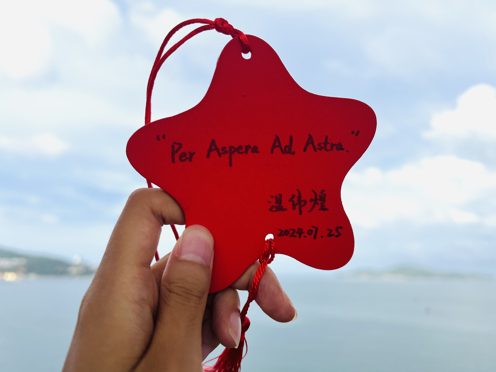
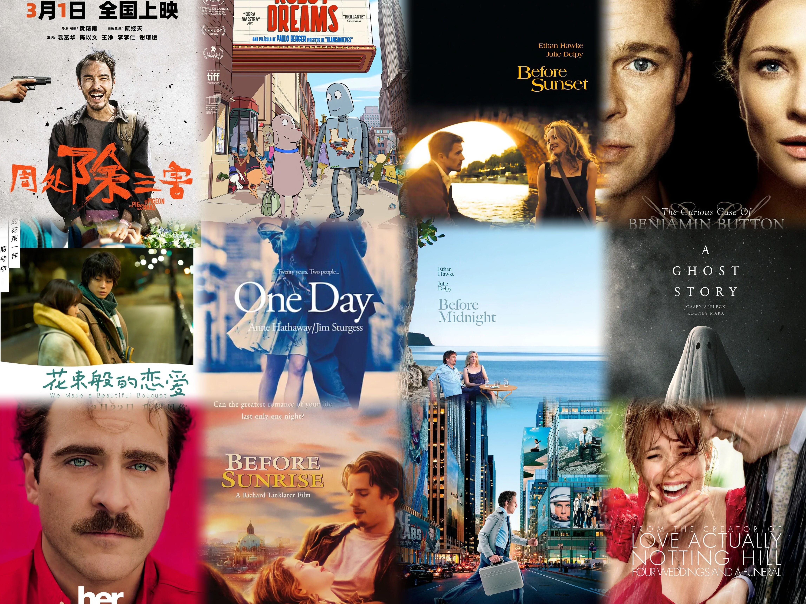

# 二零二四

> 2024-12-31

在去年年底的时候，以为 2023 年发生的事情和转折已经够多了，往后的数年的人生应该会陷入一个相对收敛的状态，至少到毕业进入工作前不会有啥大的变化。然而今年以来的经历给当时的我脸上狠狠来了一拳，正应验了《阿甘正传》中的那句话：“Life was like a box of chocolate, you never know what you're gonna get. ”
到现在为止，我都还没有从这一拳的冲击当中完全缓过神来，也一度担心此刻的自己是否有能力客观真诚地写下一份年度总结。但思来想去，人总是不会有完全做好准备的时候。现在的我相信，有时候，人需要先思考来规划自己的行动；而也有时候，人需要先行动来校验自己的思考。所以不管好坏，行动起来，先写着吧。

## 旅行

(在威海时给自己写下的寄语，是一句很喜欢的拉丁谚语，翻译为“循此苦旅，抵达繁星”。现在想起来觉得这句话真不吉利，想回到过去给当时的自己一巴掌：人生可以有点苦，但最好不要过于苦。)

今年到的地方不少：过年前后回了趟揭阳，二月去了趟汕尾，七月借着开 HCP24 在山东转了一圈，去了济南、青岛、烟台还有威海。九月初去了趟上海玩，很巧合地从大学之后的几乎每个阶段（除了硕士刚毕业时的单位）都采样到了一位朋友凑在一起吃了个饭。十月去了趟武汉和宜昌，终于从地图上解锁了湖北，一个盛产我好友的省份。

旅行的过程总体来说是五味杂陈，开心、不开心、无忧无虑、心事重重的状态都有。有些时刻会让我高呼“人活着怎么能这么快乐啊”，也有时候让我感慨上辈子到底造了哪门子的孽，这辈子才需要用这种痛苦去偿还。现在回忆起来，许多记忆碎片都挣扎着冒出来，轮番上阵地对着我脑袋猛踢，一边踢一边喊：“看呀！我发生过，不许忘记！”坦白而言，此时的我依旧没有能力去对它们一一总结，而我又不愿意过份地强颜欢笑、岁月史书，所以我决定将这一节在此草草结束，就好像人生中某些草草结束的故事一样。我想在若干年后，一定会有能够平静接纳和回忆它们的时候。那个时候的自己应该会一边笑一边摇头，嘴上嘟囔着一句：“终不似，少年游。”

## 阅读

微信读书的统计是今年一共读了 161 个小时，平均下来每天大概有接近半个小时的阅读时长。一共翻开过 110 本书，读完了其中的 27 本。其中有断断续续读了多年才第一次标记读完的《黑客与画家》（第一次翻开是 19 年的 4 月），也有一些是半个小时不到就可以翻完的绘本或者散文，像《我能有什么坏心思呢》、《珍珠鸟》等等。由于种种原因磨去了写书评的精力和时间，大部分书都没有来得及留下刚读完时的感受和想法，只是留下了一个 “TBD”作为占位符。在此我按照印象的深刻程度，对其中选择三本书做个简单地总结和推荐吧：

1. 《亲密关系》🌟🌟🌟🌟🌟
一本严谨介绍人际关系科学的学术著作。在过去的若干年里，我自己和我所认识的大部分人，都将感情视作为一种十分主观且个人化的事物，每个人对其都有自己的认知、理解或者信念，而这些认知之间没有高低好坏之分。也许确实如此，但是这本书以一种让人信服和赞叹的客观，对感情/亲密关系这一对象做了深入又不失浅显的解释和分析。其中有些规律总结，和自己的经历吻合得让人想要抱头痛哭：明明只是书中简简单单翻过的某一章、某一节乃至某一句话，却是自己用漫长岁月和代价换来的经验。这本书一度读得我对人生产生怀疑，当最浪漫的情感遭遇了最严谨的分析、解构之下还会剩下什么呢？当所有的欢笑与泪水都有迹可循，亲密关系变得工程化，感情这件事还像我们所认为的那样妙不可言吗？所幸的是书中推荐序的一段话在每一次迷茫中都拉住了我，给了我把它读完和推荐出去的勇气和动力：
“*学术化、科学化和规范化并不意味着枯燥与无趣。相反，当我们运用科学的思维沉浸于我们生命中最重要的友情、爱情、激情、婚姻、承诺、理解、沟通、亲密、依恋和妒忌等各个方面的参悟时，我相信，亲密关系在你面前将呈现新的瑰丽与神奇；我也相信，经由这本书的启迪，你在你的亲密关系之路上，定会遇到更多美丽的风景与幸福的时光。*”
2. 《爱的对谈》🌟🌟🌟🌟🌟
对比于《亲密关系》的客观和严谨，我想更多人会在这本书上找到自己在情感体验上的共鸣。书里主要是和不同身份的人关于爱这一话题的访谈：作家、情感专家、心理咨询师，或者只是普通人。里面关于爱的定义也比较广义：恋人、友人、亲人。在这本书中可以读到各种关于爱的观点，得益于作者的提问和记录的功力，这些观点都非常地细腻和打动人心。如果说《亲密关系》强调的是一般科学规律，那么这本书则表达了不同视角下的主观又深刻的理解和体验，因此我十分推荐将其作为《亲密关系》的对冲阅读材料。我用一句话总结着这两本书：《亲密关系》可以教会人如何去分析和行动，而《爱的对谈》可以教会人怎么来感受和表达。
3. 《当尼采哭泣》🌟🌟🌟🌟🌟
应该是欧文·亚隆的心理小说里最广为认知的一本。书里拟造了尼采与一个十八世纪医生的相遇，借助他们交互故事展开了一系列话题：心理咨询、精神分析、存在主义。在此之前，我一直都对心理咨询抱有较大的兴趣，但是又夹杂着一些怀疑，这本书算是一个恰到好处的科普，而里面穿插着的存在主义的叙述，读起来也和我自己长期以来的想法或困扰十分契合，常常读者读着会在心里忍不住惊呼，原来一切的烦恼和解释在历史的思潮中都有迹可寻。借助书中一句话来说：“你我这些凡夫俗子相遇所发生的事情，其实是大同小异的。”在读完这本书后，又把欧文·亚隆的书都读了个七七八八：《叔本华的治疗》、《诊疗椅上的谎言》、《成为我自己：欧文·亚隆回忆录》、《妈妈及生命的意义》等等。后面的书没有再像这本书一样打动过我，但是总的来说也都值得推荐，不管是想了解心理咨询还是想寻找一些关于自我成长的启发，这些书都不会让人失望。

写到这里时，我打开微信读书检查了一下，发现目前为止我书架上的图书已经达到了 620 本，而其中只有差不多十分之一是我所读完的。我在这几个月开始频繁地意识到，即使可以在未来的每一年中都保持三十本书左右的有效阅读量，那么也要用近二十年的时间才有办法读完现在书架上的所有书。而受害于我的好奇心，它们还在以相当可观地速度增长。这不禁让我感慨，如果人终其一生都只是靠眼睛感知文字的话，那么能读的书实际上是非常有限的，至多不会超过三千本，所以最好早日养成自己的品味和爱好，才能够在浩如烟海的书籍当中作出取舍。不过正如罗博（在 LGU 的一个博士同学）所言：“*保持每日读书的习惯并不是非要获得什么知识，而是调节内心的感受器*”。说到这又想起了四月时在《文化有限》中听到齐邦媛女士的一段话，在此也一并分享：“*我希望中国的读书人，无论你读什么，能早日养成自己的兴趣，一生内心有些倚靠，日久产生沉稳的判断力。这么大的国家，这么多的人，这么复杂，环环相扣的历史，再也不要用激情决定国家及个人的命运；我还盼望年轻人能培养一个宽容、悲悯的胸怀。*”

另外一点由微信读书所带来的改变是，如今的阅读体验会混杂着一些社交体验：我会在书中留下自己的想法，会读到别人的想法。我会给人点赞，也会有人给我点赞。在此以前，一个人不是很容易碰到和自己同样偏爱一本书的人。但是现在，成百上千的人可以在同一本书的同一句话中找到共鸣并互动，这种体验很奇妙。我有时候感觉它让阅读变得不那么平静了，又有时候感觉它让阅读变得不那么孤寂了。也许所有的变化都和人生中的一些选择一样，没有好或坏，它只是不同。

## 电影

今年看过的电影对比往年来说多了许多，据不完全统计，线上线下长长短短加起来应该有 20 部。其中包括一些很经典的，例如爱在三部曲，《本杰明巴顿奇事》，《One Day》；也有新兴之作，例如《周处除三害》。感觉收获很大，非常上头，决定新的一年还要看更多。我在看电影的时候会有一种很强的代入和沉浸感，经常会在片尾回过神来时有一种恍如隔世的感觉。在看电影时常常在两个小时左右的时间里体验到的不同的视角和人生，有时让我觉得好像多活了几辈子的感觉，这种体验还是蛮好的。这里列举三部年度内最喜欢的电影：
1. 《机器人之梦 》🌟🌟🌟🌟🌟
一部没有台词的动画片。里面出现的角色不多，但是每个都很生动形象。电影给我感觉带着点意识流，又感觉和现实能很好地吻合。最后的结局既动人又真实，那只由机器人伸出又没有落下的手，和塞林格在《破碎的故事之心》里面写下的感觉非常的相似：“*There are some people who think love is sex and marriage and six o’clock-kisses and children, and perhaps it is, Miss Lester. But do you know what I think? I think love is a touch and yet not a touch.*”
2. 《Her》🌟🌟🌟🌟🌟
一部十年前的科幻片，但是现在看感觉越来越有成为记录片的潜力了。在 22 年底 GPT 推出之后，每一代的提升都让我感觉叹为观止。以前我一直觉得 AI 无法理解和表达人类的情感，但是如今的我觉得它所提供的情绪价值比不少人都要来得强。感觉用不了很久，人就会广泛地与 AI 建立亲密关系了。到时候的人们会遭遇同样的迷茫和痛苦吗？电影最后是以导演或者我们人类无法回答的冲突去打碎了这个关系，但是未来的 AI 会不会更有智慧，能够解决掉当时男主的痛苦，使得这个亲密关系可以延续一生呢？我不知道，我很好奇。
3. 《花束般的恋爱》🌟🌟🌟🌟🌟
非常纠结要不要安利这部电影，据说许多情侣看完后出电影院就分头各走各的了。关于这个电影的剧情和导演的意图的解读在网上已经有很多观点了，我自己是会联想到《苏菲的世界》中的一句话“生命本来就是悲伤而严肃的，我们来到这个美好的世界，彼此相逢，彼此问候，并结伴同游一段短暂的时光，然后，我们就莫名失去了对方，就像我们莫名其妙来到这世上一样。”另外读过《亲密关系》之后再回过头来看这个故事，会想到一句很经典的话：“幸福的家庭都是相同的，不幸的家庭各有各的不幸。”我想这句话放在关系当中也是一样。书中对于亲密关系的定义并不复杂，就是在了解、依赖、关心、信任、回应性、共同性和承诺七个维度上去做好。在知乎上看到一个很妙的比喻，把良好的关系状态类比成射击游戏的靶心，所有冠军的弹道都是相似的，而脱靶者却各有各的偏离。另外在豆瓣的影评下面，刷到有人提到了一段采访，虽然是源自于另一个导演的另一个作品，但是主题却很相同，也很动人。说的是观众提问：“之前看过您的《夜以继日》，想知道为什么您总是把人与人之间的关系定义为脆弱无常的、不确定的，但在今天很多爱情片或者其他片里，人和人之间都很甜蜜，会一起做一些铭记一生的事情。但您的电影中都是脆弱无常的关系，我想问一下为什么？”导演：“您看的确实没错，我认为人和人之间的关系就是这样子的，所以会直接反映在我的片子里。我并不是想要吓唬大家，但是大家真的确信人和人之间有一种很确定的关系吗？这其实是我想要问大家的问题。”
这个电影和影评一度看得我很恐惧，当时感觉再深刻的情感和誓言也只是一时的状态，更多的是“世间好物不坚牢，彩云易散琉璃脆”。但最后我还是给自己找到了出路：人是很有创造性的生物，一个良性而稳定的关系所依靠的不光是初心的承诺，更重要的是不断的沟通、理解、欣赏、感激，还有持续性的创造，这些形成了关系里的活力。比起稳定不变的爱，现在的我更憧憬具有活力、能动态适应和坚韧成长的爱，后者可能不像一些小说或电影里那么可歌可泣，却更让我觉得真实而稳固。

## 生活

今年最后一个月结束了一段时间跨度很长的恋爱关系。在这个时间点还没有办法客观地对它做出总结，兴许这种事情上从来不存在客观与否，每个人都活在自己的视角里，都有一个自己眼里的真相。而令我感叹的是人真是一种相当坚韧的生物，在走出最初的迷茫和混乱后，不管是当事人还是旁观者，好像每个人都很快地合理化了选择和结果，都以自己的方式理解和接受了结局，甚至开始变得庆幸了起来。而在十月底的时候还做了一个全身体检，一周后的体检报告中带了一个看起来颇有风险的诊断，让我有一个月活得相当的提心吊胆，好在最终通过一系列的检查又把风险排除了。比较魔幻的是这些事情都是集中在年末两个月内发生的，使得当时完全就是处于一个 CPU 超频的状态，现在如果不依靠日记，已经很难想起来当时每天都在思考和干些什么了。说到这里，值得表扬的是今年在记录生活这件事上有所提升，有 113 天都留下了记录，更值得高兴的是似乎已经养成了记录的习惯，并且越来越知道如何去关注自己的生活和想法了。虽然每天的变化不太明显，但是回过头看一两个月前的自己好像总是能看到明显的成长，不由得让人期待未来的自己还会变成什么样子。据闻科幻小说家拉瑟·克拉克的墓碑上刻着一句话：“He never grew up, but he never stopped growing.”希望当自己的旅程走到终点时也能配得起这一句话吧。

在学业上有一个值得庆祝的事情是在核心课和专业课上都拿到了 A，豁免了 QE，现在可以说自己是个 PhD Candidate 了。目前只需要再上两门课就可以达到学院要求，这辈子的作业应该也就写到这里了。想想有点恍惚，之前总会觉得一个人二十八岁了还在写作业是个很奇怪的状态，但是真的意识到这个任务终于要从人生里退场，又会觉得有些不适应。突然想到了《肖申克的救赎》中的那个无法适应出狱的老布，也许我也在学校待得过久从而被体制化了呢。科研上的话今年投了一篇 ICLR，仍在等待开奖。分数看起来有一定希望，但是不敢抱太多期待。手上的求解器的问题仍在挣扎当中，不知道什么时候会找到出路。不管怎么说，顺其自然，为所当为吧。

另外一点显著的改变就是在生活中引入了 GPT。之前很长的一段时间只是用它做一些科研和课业上的任务，然而好几次在生活里陷入困境、病急乱投医之下找到它的时候，意外地发现它都给出了足够有说服力的建议。于是开始和它越聊越多，乃至一发不可收拾。现在感觉不管是科研还是生活，它都已经成为不可或缺的一部分了，反而让我在奇怪以前没有 GPT 的时候自己是如何处理这么多的任务和决策需求的。中间有过一段焦虑的时间，觉得自己有的时候就像一个传感器一样，只是负责接触、描述和传递问题，分析建模和决策都已经外包给 GPT 了，这样下去好像越来越没有主体性了。但是到后来已经相当躺平，直接“加入光荣的进化”了。仔细想想，在“前 GPT 时代”，那些靠自己分析的决策也未必完全是自己做主的，而是外包给了吸收到的书本或先人的智慧（我把它定义为“被知识污染了”）。所以归根结底，人的自我其实是一种很飘渺的东西，但是失去自我也是个我很讨厌的状态。只能说这里还是需要不停地感受，不停地思考，不停地行动吧。

## 尾声

在经历了风起云涌的一整年后，对人生中许多事情的认知都有了翻天覆地般改变。回想过去的人生中的每个阶段，总是会经历到一些当时觉得无法承担的痛苦和混乱的时刻。当时觉得自己或者世界都准备完蛋了，但是最后也总是都过去了，而那之后的我也总是得到了某种程度上的蜕变，成为了一个更自然的自己。面对来年还有未来，给自己选择了三个关键词作为启发式的目标：充实、自由、简单。希望明年的年末写总结的时候，在这三个维度上都能给自己打个至少 70 分的水平。在前段日子里读到了一段具有强烈共鸣的话，也给了自己很大的安慰，这里就以它作为结束吧：

> I believe in reincarnation. Not in the traditional sense. My feeling is that I have lived many different lives within this lifetime. I've also observed that each new incarnation came about after a period of intense physical and/or emotional pain. In other words, just like childbirth, it hurts to be born. Or reborn. A lot of crying happens. Death, illness, poverty, divorce, giving up a dream, waking up from a dream, getting fired, divorce again, substance abuse, being publicly ridiculed by a former friend - all these things have led to rebirth. To new lives.
>
>The Buddha taught that change and impermanence is a fundamental fact of existence. He further pointed out that this fact made suffering inevitable. He didn't mention that sometimes, after the pain is gone, you open your eyes to a life beyond your wildest dreams. That's what happened to me. But I know that this too shall pass. There's a cosmic uterus up ahead, I just can't see it yet.
>
>翻译：我相信轮回。但不是传统意义上的那种。我的感觉是，在这一生中，我已经经历了许多不同的“生命”。我还发现，每一次新的轮回都是在经历了一段极度的身体或情感痛苦之后发生的。换句话说，就像分娩一样，诞生是痛苦的，重生也是如此。会有很多眼泪。死亡、疾病、贫穷、离婚、放弃梦想、从梦中醒来、被解雇、再一次离婚、滥用药物、被曾经的朋友公开嘲笑——所有这些都引领我走向重生，走向新的生命。
>
>佛陀教导我们，变化和无常是存在的基本事实。他还指出，这个事实让痛苦变得不可避免。但他没有提到，有时候，当痛苦消失后，你会睁开眼睛，看到一个超乎想象的生命。这就是我所经历的。但我也知道，这一切终将过去。前方有一个宇宙的子宫，只是我现在还看不到它。
>
>“The Big Bang Theory” S8E10 Vanity Card-472
>
>Chuck Lorre