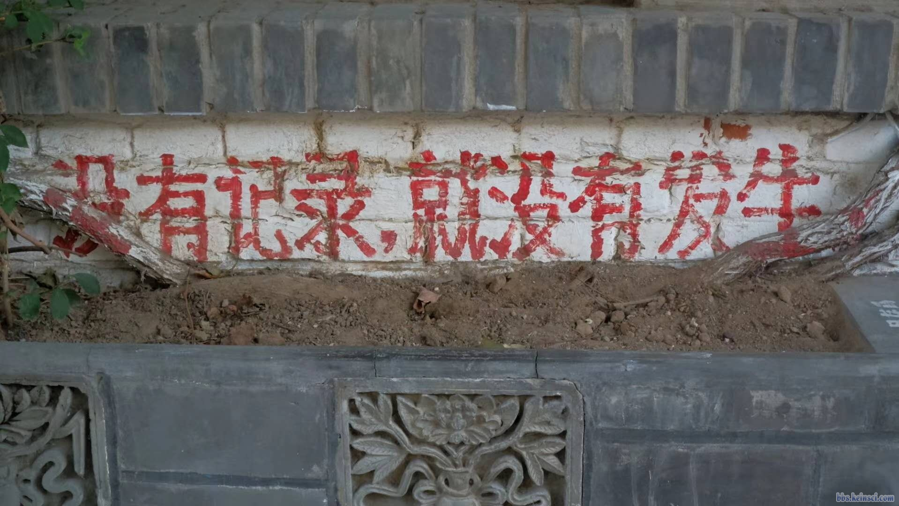

# Rocks 集群安装指北

> 2021-06-10

最近组里的集群挂了两块硬盘后，系统就彻底挂掉起不来了。集群供应商派来的工程师在换好硬盘后，表示之前免费安装的 Rocks 系统在这几年已不再提供安装。
对于集群管理系统，他们现在只提供 [BCM (Bright Cluster Manager)](https://www.brightcomputing.com/brightclustermanager) 一种方案。
按照我们集群节点数计算，大概每年需要十万块钱（是的，这系统还是订阅制的）。

考虑到这服务器已经相对年迈，每年交的这保护费估计已超出它现在的身价，采购 BCM 的性价比实在是太低了。
辗转反侧，我决定自力更生，自己来尝试进行 Rocks 的安装，并在此留下记录，以示后人。
在此可以简单介绍一下 Rocks。Rocks 是一个开源的集群系统，应该是市场上为数不多免费的的 HPC (High Performance Computing, 高性能计算) 集群方案之一了。这里是它的[项目主页](http://www.rocksclusters.org/) 和 [GitHub 主页](https://github.com/rocksclusters)。
现在能检索到的资料中，主流安装的 Rocks 版本有 6 和 7 两个版本，分别基于 CentOS 6.6 与 CentOs 7.4。之前集群的版本为 Rocks 6，由于 CentOS 版本过低，在安装一些依赖时非常麻烦，也没有 systemd 的功能。考虑到以上缺点，这次计划从 Rocks 7 开始进行安装实验。以下为调研得到的安装步骤，如在实践时有所出入会进行更新。

## 安装步骤

## 参考资料

> Rocks 6:
> - [rocks集群部署](https://blog.51cto.com/wenzengliu/1871118)
> - [rocks cluster 安装过程](https://blog.whatsroot.xyz/2017/05/08/rocks-install/)
> - [Linux集群rocks的安装和SGE管理调度MS5.5作业](http://muchong.com/t-4547872-1)

> Rocks 7:
> - [Rocks Base Users Guide](http://central-7-0-x86-64.rocksclusters.org/roll-documentation/base/7.0/index.html)
> - [Rocks Cluster 7.0 Manzanita (CentOS 7.4)前端节点安装——神坑及处理全纪录](http://bbs.keinsci.com/thread-19823-1-1.html)
> - [rocks7 高性能计算机群（HPC）安装笔记](https://zhuanlan.zhihu.com/p/166168966)

> Rocks ?:
> - [基于Rocks的高性能集群平台搭建与应用](http://manu46.magtech.com.cn/ces/CN/article/downloadArticleFile.do?attachType=PDF&id=8940)