# Rocks 集群安装指北

> 2021-06-10


最近组里的集群挂了两块硬盘后，系统就彻底挂掉起不来了。集群供应商派来的工程师在换好硬盘后，表示之前免费安装的 Rocks 系统在这几年已不再提供安装。
对于集群管理系统，他们现在只提供 [BCM (Bright Cluster Manager)](https://www.brightcomputing.com/brightclustermanager) 一种方案。
按照我们集群节点数计算，大概每年需要十万块钱（是的，这系统还是订阅制的）。

考虑到这服务器已经相对年迈，每年交的这保护费估计已超出它现在的身价，采购 BCM 的性价比实在是太低了。
辗转反侧，我决定自力更生，自己来尝试进行 Rocks 的安装，并在此留下记录，以示后人。
在此可以简单介绍一下 Rocks。Rocks 是一个开源的集群系统，应该是市场上为数不多免费的的 HPC (High Performance Computing, 高性能计算) 集群方案之一了。这里是它的[项目主页](http://www.rocksclusters.org/) 和 [GitHub 主页](https://github.com/rocksclusters)。
现在能检索到的资料中，主流安装的 Rocks 版本有 6 和 7 两个版本，分别基于 CentOS 6.6 与 CentOs 7.4。之前集群的版本为 Rocks 6，由于 CentOS 版本过低，在安装一些依赖时非常麻烦，也没有 systemd 的功能。考虑到以上缺点，这次计划从 Rocks 7 开始进行安装实验。以下为调研得到的安装步骤，如在实践时有所出入会进行更新。

## 安装步骤

### 1.安装准备

#### 1.1 物理组装

在 Rocks 集群中，节点被分为前端节点（也叫管理节点，Frontend Node）和计算节点（Compute Node）。
二者通过交换机连接，其中前端节点必须有两张网卡，一张网卡（默认为 eth1）连接公网，另一个网卡（默认为 eth0）连接交换机，节点之间的拓扑如图所示：

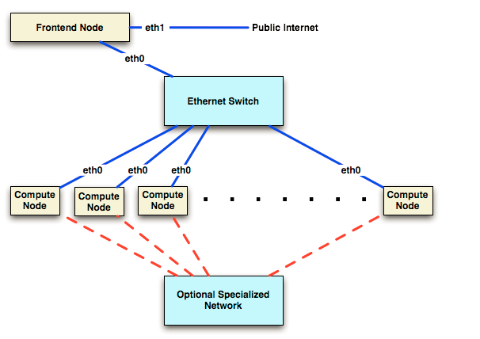

#### 1.2 制作启动盘

在 Rocks 官网的[下载区](http://www.rocksclusters.org/downloads/2017-12-01-download-rocks-7-0-manzanita.html)可以下载到全部镜像（这些也被成为 roll），在此我们选择用 [kernal 镜像](http://central-7-0-x86-64.rocksclusters.org/isos/kernel-7.0-0.x86_64.disk1.iso)制作启动盘，可以借助 [rufus](https://rufus.ie/en_US/) 一类工具烧录到 U 盘中，制作成管理节点的系统盘。

#### 1.3 搭建局域网下的 roll server

Rocks 7 支持网络安装，即提前把所有系统所需的 Roll(类似于系统组件/包) 下载到可被前端节点访问到的地方，在安装过程中管理节点会自动去请求这些资源。
此处我们选择将官网的[下载区](http://www.rocksclusters.org/downloads/2017-12-01-download-rocks-7-0-manzanita.html)下全部的 16 个镜像下载下来后，先进行 md5 检查确保文件完整，随后进行解压，再搭建一个 http 服务器对外提供访问服务（据说更推荐 Nginx），下图为搭建好的 roll server。

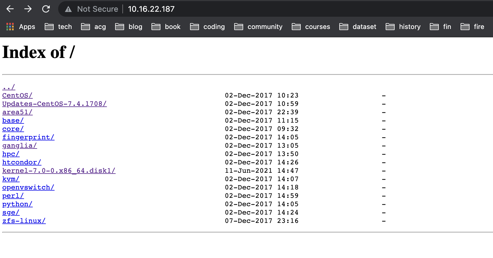

#### 1.4 Raid 阵列卡配置（可选）

我们的服务器上有两张阵列卡，不过所有的硬盘都接在其中一张 LSI 芯片的阵列卡上，在更换完硬盘后需要进行 Raid 的配置。
此处处于我的知识盲区，幸亏得到系里运维工程师相助，得以顺利解决。
如果后续需要再次配置阵列卡，可参考这篇[博文](https://www.yeboyzq.com/yingjianweihu/942.html)。

### 2.前端节点安装

1. 把 U 盘插到前端节点上，开机，设置 Boot 启动项中首先从 U 盘启动，退出重启，启动后得到如下画面：

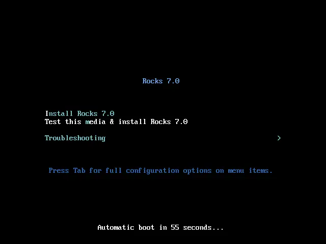

2. 进入语言选择界面，选择 English > English(United States) 并继续：

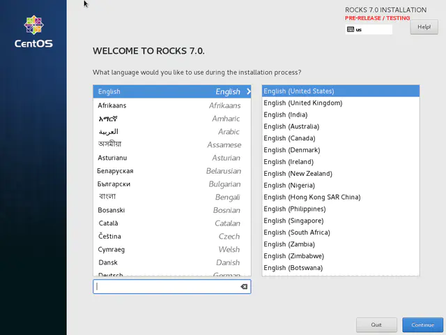

3. 配置网络，选择 NETWORK & HOSTNAME

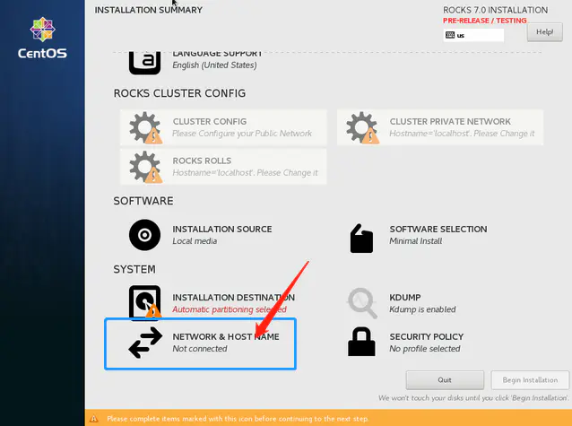

切换到 IPv4 Settings > Method，按照指南此处应该选择 Manual 并手动添加 Address、Netmask、Gateway。同时按照参考资料，此处的域名不能瞎写，需要按照标准的 Fully Qualified Domain Name 进行配置命名，否则后续会产生错误：

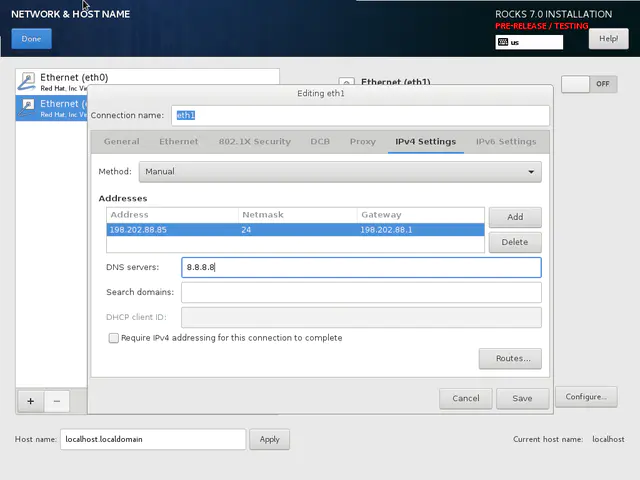

我们服务器的网络设置为：
```
Address 172.18.6.61
Netmask 255.255.255.0
Gateway 172.18.6.254
DNS 172.18.1.92
```

4. 配置内网 ip：

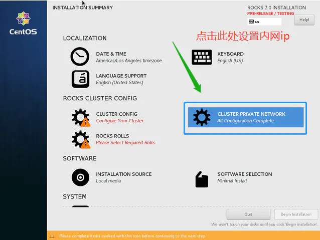
   
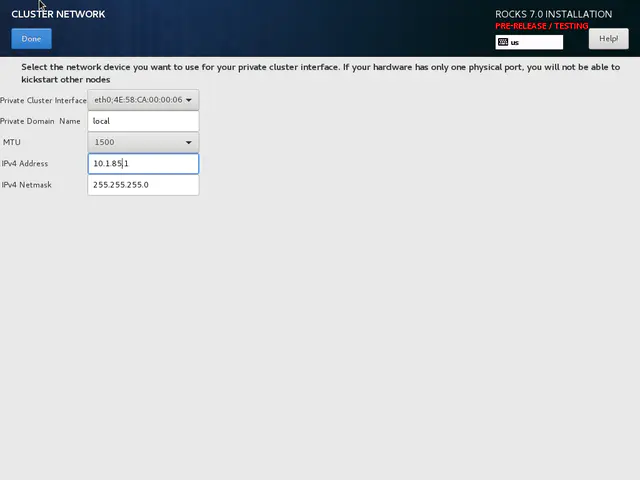

5. 进行 rolls 的安装，选择所有的 roll 都进行安装：

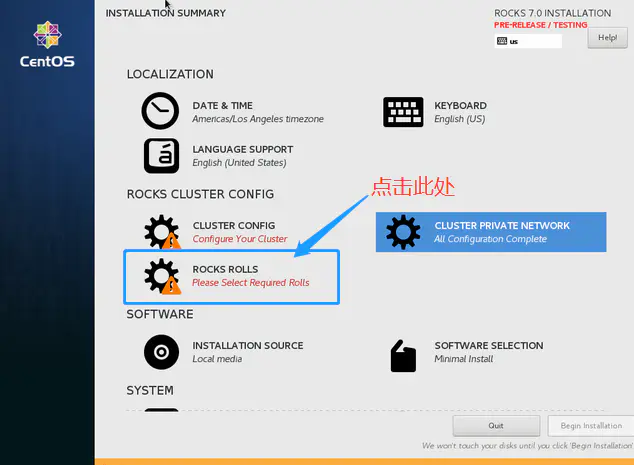

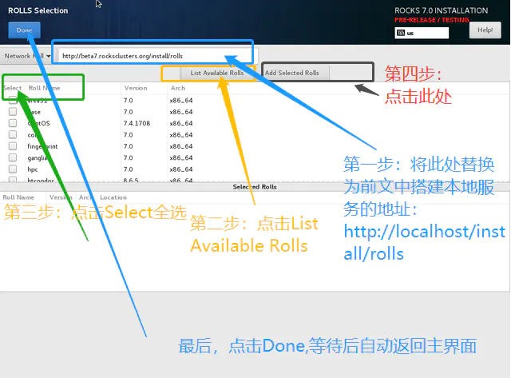

6. 配置集群（无特殊需求不作改动）：

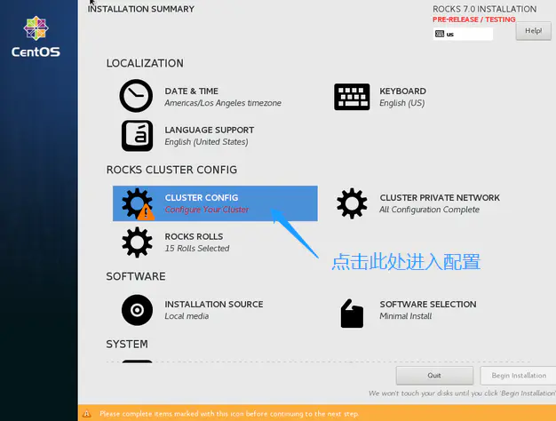

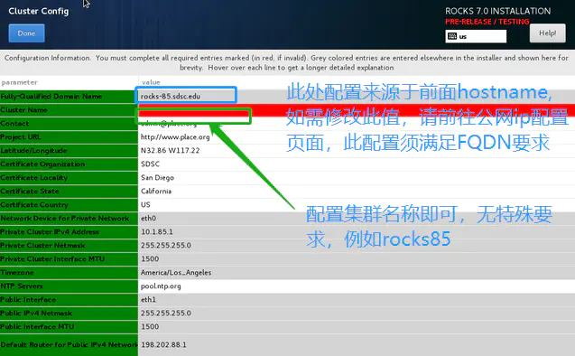

7. 配置分区，可选择自动分区也可自动分区，手动分区的话方案可以为：

```
/     100GIB
/tmp     50GiB
/boot    1024MiB
/boot/efi  512MiB
swap    50GiB
/export    全部其他空间
```

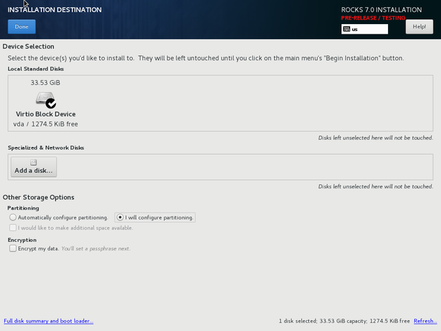

8. 开始安装：

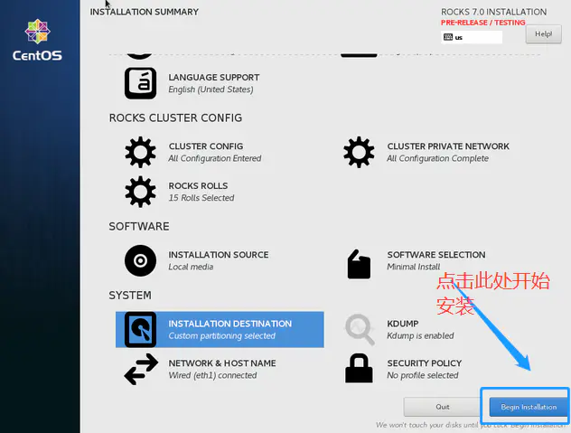

9. 在安装过程中可设置 root 密码：

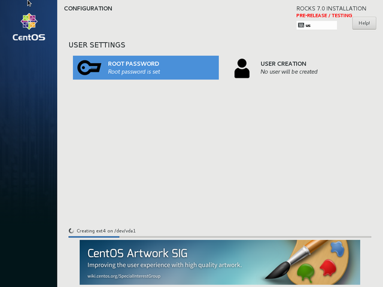

10. 安装完成，如果一切顺利，最后的安装界面应该如下图所示，此时可以拔出 U 盘，重启前端节点：

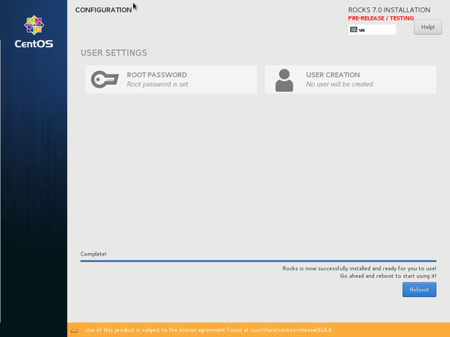


### 3. 计算节点安装

0. 在开始安装之前，按照[如下方法](http://central-7-0-x86-64.rocksclusters.org/roll-documentation/base/7.0/faq-installation.html#COMPUTE-KICKSTART-FILE)先检查一下前端节点的以下服务：dhcpd, httpd, mysqld, autofs。
在准备完成后执行命令
```
rocks list host profile compute-0-0
rocks list host profile compute-0-0 > /dev/null
```
进行检查，如有错误，参考[以下方法](https://lists.sdsc.edu/pipermail/npaci-rocks-discussion/2015-April/067307.html)重新制造 distro
```
cd /export/rocks/install
rocks create distro
```
过程中可参考 google group 的[这一帖子](https://groups.google.com/g/rocks-clusters/c/Vx8YqVaRpXI/m/GHHNlrl0ajkJ)。

1. 通过 root 身份登录前端节点。

2. 打开 terminal，在 Shell 中输入命令：

```bash
# insert-ethers
```

会出现如下界面：

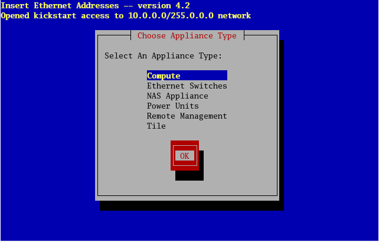

3. 选择 Compute，接下来可以看到以下界面，代表正在等待安装计算节点：


4. 启动计算节点，并设置它的 booting 顺序为 PXE 优先，即网卡启动。

5. 顺利的话，前端节点这边的界面会收到 DHCP 请求并显示：


过一会可以看到计算节点被发现，「（）」代表节点尚未请求好 kickstart 文件：

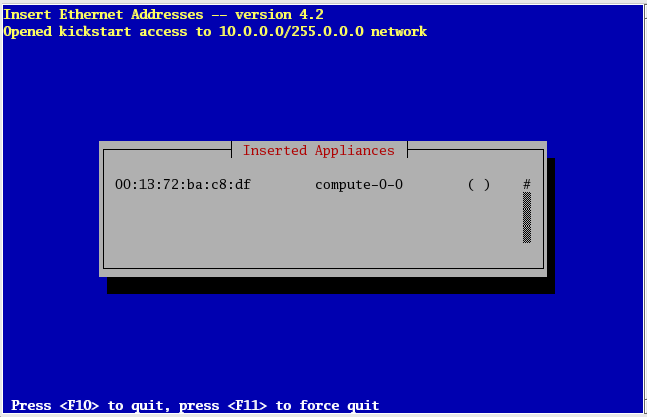

## bug 记录


## 参考资料

> Rocks 6:
> - [rocks集群部署](https://blog.51cto.com/wenzengliu/1871118)
> - [rocks cluster 安装过程](https://blog.whatsroot.xyz/2017/05/08/rocks-install/)
> - [Linux集群rocks的安装和SGE管理调度MS5.5作业](http://muchong.com/t-4547872-1)

> Rocks 7:
> - [Rocks Base Users Guide](http://central-7-0-x86-64.rocksclusters.org/roll-documentation/base/7.0/index.html)
> - [Rocks 7.0 Manzanita (CentOS 7.4)前端节点安装笔记（附常见错误解决说明）](https://www.jianshu.com/p/9e03ff1a6d30)
> - [Rocks 7.0 Appendix A. Frequently Asked Questions](http://central-7-0-x86-64.rocksclusters.org/roll-documentation/base/7.0/faq-installation.html#COMPUTE-KICKSTART-FILE)
> - [rocks7 高性能计算机群（HPC）安装笔记](https://zhuanlan.zhihu.com/p/166168966)
> - [rocks7 集群安装笔记](https://www.omicsclass.com/article/1399)
> - [Rocks Cluster 7.0 Manzanita (CentOS 7.4)前端节点安装——神坑及处理全纪录](http://bbs.keinsci.com/thread-19823-1-1.html)
> - [The npaci-rocks-discussion Archives](https://lists.sdsc.edu/pipermail/npaci-rocks-discussion/)

> Rocks ?:
> - [基于Rocks的高性能集群平台搭建与应用](http://manu46.magtech.com.cn/ces/CN/article/downloadArticleFile.do?attachType=PDF&id=8940)