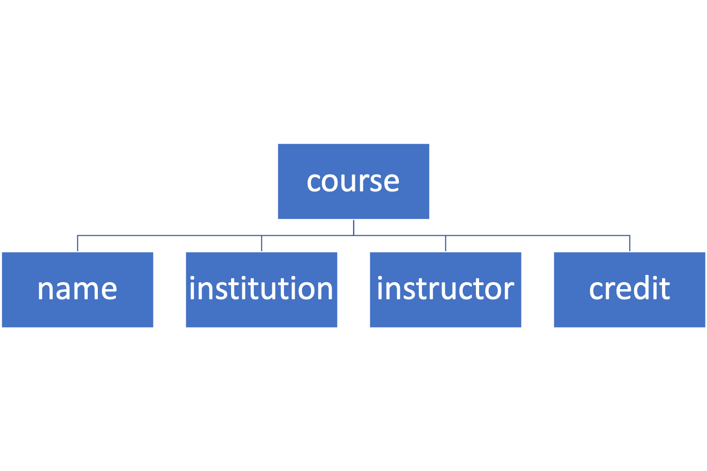

# 标记语言杂谈：XML, HTML, Markdwon 及 RMarkdown

> 2021-09-02

*注：此文献给一个被各种标记语言折磨得要报警的家伙。*

## 定义

官方来说，标记语言（markup language）是一种把文本以及和文本有关的信息结合起来的一种表达方式。比起纯文本，标记语言可以通过借助**标记（markup）**来极大的增强文字的信息和结构的描述能力。
举例而言，其实小时候老师批改过的作文就算是一种现实中的标记语言，类似：用红笔波浪线标记出写得精彩的句子，用直线标记出语法错误，用圈圈标记出错别字。而当我们在用电脑上的纯粹的电子文本传递信息的时候，我们没有类似红笔这种圈圈画画的工具，为了实现对文本的一些语义，结构的表达，我们就可以去定义一些标记，在实际使用的时候我们通常是用**标签（tag）**，通过这些标签来增强文本的的表达能力，同时使其能表达结构化的信息。

## 常见的标记语言：XML 与 HTML

### XML 简介

XML 的全称为 eXtensible Markup Language，即**可扩展的标记语言**，而 HTML 的全称为 HyperText Markup Language，即**超文本标记语言**。实际上从发明时间上来说，XML 要晚于 HTML（前者发明于 1998 年，而后者由 Web 之父 Tim 发明于 1989 年）。但是从地位上来说，XML 更像是 HTML 的一种元语言，因此我们先介绍 XML。

我们在定义中提过，标记语言的发明是为了增加文本的结构化的表达能力，比如我们要介绍开设在 NUS 的 Big Data in Marketing 这门课程，用纯文本的话我们的描述是：

```
1. 有一门名字叫 Big Data in Marketing 的课程，它的开设地点为 NUS，它的讲师为 Liu Qizhang，它的学分为 3。
2. Big Data in Marketing 是 NUS 的一门课，是 Liu Qizhang 来讲，修完可以拿 3 个学分。
3. ……
```

可以看到，当我们只用纯文本来介绍时，同一个信息有许多种表述方式，对人类来说阅读起来可能影响不大，但是如果希望由计算机程序来处理和提取这些信息的话，这种自然语言描述的文本会带来非常多的麻烦，尤其是当存在许多门课程需要描述时，不同人的不同语言描述会使得最后的信息表达变得杂乱无章。

那么，我们现在就可以尝试使用 XML，通过定义几个标签（tag）：&lt;course&gt;、&lt;name&gt;、&lt;institution&gt;、&lt;instructor&gt;、&lt;credits&gt;，我们可以来重新介绍这门课：
```xml
<course>
    <name>Big Data in Marketing</name>
    <institution>NUS</institution>
    <instructor>Liu Qizhang</instructor>
    <credits>3</credits>
</course>
```

这种描述方式可能第一眼看上去非常抽象（对于非程序员来说）。但仔细思考可以发现，这种通过**标签（tag）对**所表达的信息是非常结构化的，而且自带了一个很强的规范。借助这样的标签对，不同的人来描述同一门甚至不同的课，都会是同一样的结构。同时，对于计算机程序而言，从这样结构化的 XML 中，解析出想要的信息也非常容易，非常方便进行存储，统计，分析，以及**渲染**或可视化。

### XML 树与 XPath

所有的 XML 文档都是由嵌套的**标签对**嵌套着组成，因而，我们可以把 XML 文档解析成一种树（tree）的形状，以上一个 XML 文档为例，我们就可以把它解析成如下一颗 XML 树：



也可以把 XML 的内容复制到在线的[xml 解析器](https://jsonformatter.org/xml-parser)进行解析查看。

可以发现，每个原 XML 文档中的标签，在解析后都会对应 XML 树中的一个**节点（node）**，同时 XML 文档中标签的**嵌套关系**与 xml 树中节点的**层级关系**是一致的。例如在 xml 文档中位于最外层的 &lt;course&gt; 标签解析后处于 xml 树的最上方，我们一般称呼其为根节点，简称根（root）。

由于 XML 文档非常的结构化，我们可以通过一些简单的规则去定位 XML 的元素的值。例如我想获取以上课程的 XML 文档的 credits，那么我们可以就可以通过 `/course/credits` 来获取到这个内容，而这种定位元素的方式也叫 XPath，简而言之，XPath 是用来描述/选择 XML 中的元素的语言，详细的 XPath 语法可以从[这里](https://www.w3schools.com/xml/xpath_syntax.asp)获取到。

### HTML

HTML 的全称为 HyperText Markup Language，即**超文本标记语言**。从结构上看，HTML 可以看成是一种特定的 XML 语言。
特殊的是，它有着一套固定的，专门用于表示网页的标签（tag）集，如 &lt;html&gt;、&lt;head&gt;、&lt;body&gt; 等等。
以下是个经典的 HTML 文档：

```html
<html>
    <head>
        <title>Demo</title>
    </head>
    <body>
        <h1>My First Heading</h1>
        <p>My first paragraph.</p>
    </body>
</html>
```

标准的 HTML 文档的标签可以被所有的主流浏览器解析并渲染，比如你可以把上面的内容复制到一个叫 test.html 的文件，然后用浏览器打开，即可以看到这个文档被渲染后的效果，或者也可以把 HTML 文档复制到[这个链接](https://www.w3schools.com/html/tryit.asp?filename=tryhtml_basic_document)下查看渲染效果。

目前互联网上大部分的网页内容都会由 HTML 编写，同时既然 HTML 是 XML 的一种，那它同样可以被解析成一个 HTML 树，而且同样可以用 Xpath 来选去文档中的某个标签内的内容。由于大部分的 HTML 文档比较复杂，很难直接看出某个标签的 Xpath，因此有许多浏览器插件支持直接生成网页某个标签的 Xpath 路径，类似 SelectorGadget，或者 Google 浏览器的「审查（Inspect）」功能（按下 F12）也支持查看某个标签的 Xpath，在生成 Xpath 后，可以通过 R 快速提取对应元素内容。


